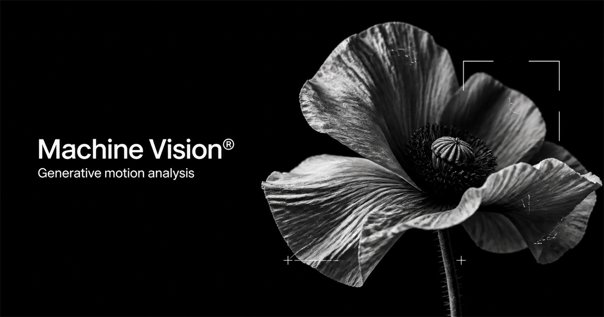

# Machine Vision®

A browser-based visual instrument that interprets video as a changing field of points, signals, connections, labels and selective focus.



## What it does

- Analyses contrast, edges, luminance and motion locally in the browser.
- Generates deterministic procedural overlays with points, connections, brackets, labels and tracking boxes.
- Supports local MP4, WebM and MOV uploads without sending frames to a server.
- Adapts framing with Auto, Fit and Fill modes.
- Includes custom overlay colour and non-destructive image treatments.
- Exports a five-second composite clip containing the visible video treatment and overlay.
- Offers editable presets, seeded variation and a full randomisation system.

The repository intentionally ships without a bundled video. Bring any local clip to start; this keeps the project lightweight and avoids redistributing third-party footage.

## Run locally

Requirements: Node.js 22.13 or newer and pnpm.

```bash
pnpm install
pnpm dev
```

Open `http://127.0.0.1:5173/`.

### Windows one-click launcher

Double-click `START_MACHINE_VISION.cmd`. Use `STOP_MACHINE_VISION.cmd` when you are finished.

Do not open `index.html` directly. Vite needs to serve the application.

## Use your own video

1. Select **Upload video**.
2. Choose a local MP4, WebM or MOV file.
3. Open **Tune** to shape the analysis, composition, framing and colour.
4. Select **Export clip** to record and download a five-second composite.

The source video stays on your device. Uploaded files are represented by a temporary browser URL and are forgotten when the page is refreshed.

## Privacy

Machine Vision has no upload endpoint, database, analytics SDK or application backend. Video frames and exports are processed in browser memory and are never sent to the host. The deployed build also blocks outbound application connections with a restrictive Content Security Policy.

Only the selected visual configuration and preset are saved in local browser storage. Hosting infrastructure may still receive ordinary request metadata when the page and its static assets are loaded; it never receives the selected video. See [PRIVACY.md](PRIVACY.md) for the complete data-flow summary.

## Export compatibility

The exporter uses the browser's supported `MediaRecorder` format. It prefers MP4/H.264 when available and falls back to VP9, VP8 or WebM. Export runs in real time and records the first five seconds at up to a 1920 px long edge.

Current Chrome, Edge and Safari are recommended. Very large source files may be limited by available device memory.

## Production build

```bash
pnpm build
pnpm preview
```

## Contributing

Issues and focused pull requests are welcome. See [CONTRIBUTING.md](CONTRIBUTING.md).

## Author

Created by [Amir Mushich](https://amirmushich.com) — creative director and AI strategist building repeatable creative workflows, tools and visual systems.

## License

[MIT](LICENSE)
